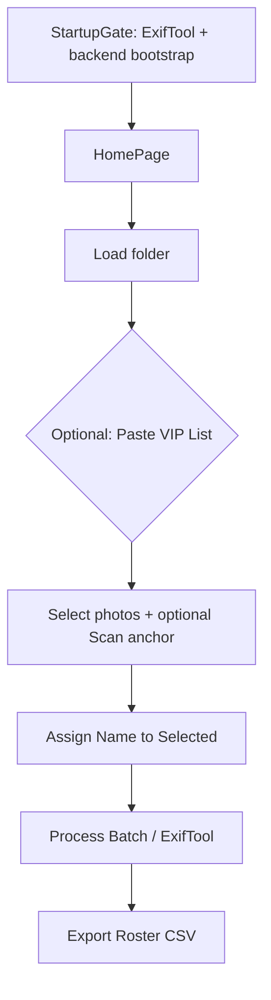

# CaptionFast — Current State Machine & User Flow Audit

**Source:** `frontend/lib/main.dart` (single source of truth)  
**Date:** 2026-05-19  
**Purpose:** Document actual runtime behavior before adding features.

This document maps **conceptual names** from `.cursorrules` to **code identifiers** as they exist today. The implementation uses **Riverpod** `StateNotifierProvider`s for folder/selection/tags in addition to `_HomePageState` fields managed via `setState`.

---

## Name Mapping (Conceptual → Code)

| Conceptual (`.cursorrules`) | Code identifier | Type | Owner |
|----------------------------|-----------------|------|--------|
| `anchorpath` | `_scannedAnchorPath` | `String?` | `_HomePageState` |
| `selectedphotos` | `selectedFilesProvider` → `Set<String>` | `Set<String>` (normalized paths) | `SelectedImagesNotifier` (Riverpod) |
| `processedfiles` | `_processedFiles` | `Set<String>` (normalized paths) | `_HomePageState` |
| `sessiontags` | `_sessionTags` | `Map<String, String>` (filename → subject) | `_HomePageState` |
| `viplist` | `_vipList` | `Set<String>` (lowercase names) | `_HomePageState` |

**Related state not in the audit list but required for the workflow:**

| Role | Code identifier | Type |
|------|-----------------|------|
| Loaded JPEG paths | `loadedFilesProvider` | `List<String>` |
| Pending assignments (pre-ExifTool) | `taggedFilesProvider` | `Map<String, String>` (full path → VIP/subject) |
| Subject name field | `_tagController` | `TextEditingController` |
| VIP match UI flag | `_isAnchorVipMatch` | `bool` |
| Range-select anchor index | `_lastClickedIndex` | `int?` |

---

## Lifecycle: State Variables

### 1. `anchorpath` → `_scannedAnchorPath`

| Event | Mutation |
|-------|----------|
| App start / `HomePage` created | `null` |
| User confirms “Replace Anchor?” before scanning a different single selection | Set to `null` (then scan proceeds) |
| Successful OCR scan (`_scanSelectedAnchorPhoto`) | Set to the normalized path of the single selected photo |
| Failed / empty / error scan | Unchanged (remains previous value or `null`) |
| Successful **Process Batch** (`_processBatch`, all files succeed) | Set to `null` |
| Folder load via empty-state drop zone (`pickFolderAndLoadJpegs`) | **Not cleared** |
| Folder change via breadcrumb (`_pickFolderFromBreadcrumb`, after discard confirm) | **Not cleared** |
| Refresh folder (`_refreshCurrentFolder`) | **Not cleared** |
| Clear Selection button | **Not cleared** |
| Widget dispose | Field discarded with widget |

**UI coupling:** Grid shows gold border + focus icon when `filePath == _scannedAnchorPath`. This is independent of whether that file is still in `selectedphotos`.

---

### 2. `selectedphotos` → `selectedFilesProvider`

| Event | Mutation |
|-------|----------|
| App start | Empty set `{}` |
| Normal thumbnail click | `selectOnly(filePath)` — replaces set with one path |
| Ctrl+click | `toggle(filePath)` |
| Shift+click (with `_lastClickedIndex != null`) | `selectRange(imagePaths, from, to)` |
| Lasso drag (pan ≥ 8px) | `addPaths(paths)` — union with existing selection |
| Assign Name to Selected | **No change** (selection unchanged) |
| Successful Process Batch (all ExifTool runs succeed) | `clear()` |
| Clear Selection | `clear()` |
| Empty-state folder load (after pick) | `clear()` |
| Breadcrumb folder change (after discard) | `clear()` |
| Refresh folder | `keepOnlyPaths(valid)` — drops paths no longer on disk |
| `ImagePathsNotifier.clear()` | Not called directly on selection except via above |

Paths are always normalized via `p.normalize()` inside the notifier.

---

### 3. `processedfiles` → `_processedFiles`

| Event | Mutation |
|-------|----------|
| App start | Empty set `{}` |
| Each file with ExifTool `exitCode == 0` in `_processBatch` | `add(normalizedPath)` |
| ExifTool failure for a file | That path not added; earlier successes remain |
| `_clearSessionProcessedFiles()` | `clear()` — also clears `_sessionTags` and `_lastClickedIndex` |
| Called from: empty-state folder load; breadcrumb folder change | Yes |
| Successful Process Batch | **Not cleared** (session badges persist) |
| Clear Selection | **Not cleared** |
| Assign Name to Selected | **Not cleared** |

**UI coupling:** Green `_SessionTaggedBadge` when `_processedFiles.contains(filePath)`.

---

### 4. `sessiontags` → `_sessionTags`

| Event | Mutation |
|-------|----------|
| App start | Empty map `{}` |
| Each file with ExifTool `exitCode == 0` in `_processBatch` | `[p.basename(normalizedPath)] = tagValue` (subject string used for metadata) |
| Partial batch failure | Successful files still recorded; failed files omitted |
| `_clearSessionProcessedFiles()` | `clear()` |
| Export Roster (CSV) | Read-only; writes `CaptionFast_Roster.csv` from sorted keys |
| Successful Process Batch | **Not cleared** |
| Clear Selection / folder refresh | **Not cleared** (except full session clear on folder load paths above) |

CSV columns: `Filename`, `Tagged Subject`. Export button enabled only when `_sessionTags.isNotEmpty`.

---

### 5. `viplist` → `_vipList`

| Event | Mutation |
|-------|----------|
| App start | Empty set `{}` |
| Paste VIP List dialog → Save | Replaced with `_parseVipListFromText`: non-empty lines, trimmed, **lowercased** |
| Paste VIP List → Cancel | Unchanged |
| Folder load / batch / clear selection | **Not cleared** (persists for entire app session) |
| Subject field or post-scan text change | Does not mutate `_vipList`; updates `_isAnchorVipMatch` via `_isVipName(text)` |

**Runtime use:**

- UI: “VIP MATCH” banner when `_isAnchorVipMatch`.
- ExifTool: if `_isVipName(tagValue)` then adds `-XMP:Rating=5` (not `-XMP:Label=Red` as described in root `.cursorrules`).

---

## Pending tags: `taggedFilesProvider` (pre-batch)

Not one of the five audited names, but it gates **Process Batch**:

| Event | Mutation |
|-------|----------|
| Assign Name to Selected (`_assignTag`) | For each path in `selectedphotos`, map entry `path → trimmed(_tagController.text)`; no-op if VIP name empty or selection empty |
| Breadcrumb folder change | `clear()` |
| Refresh folder | `keepOnlyPathsWithTags(valid)` |
| Process Batch success | **Not cleared** — entries remain in map |
| Empty-state folder load | **Not cleared** |
| Clear Selection | **Not cleared** |

---

## Step-by-Step User Workflow

High-level path: **Folder Load → VIP Paste → Selection → Assign (name) → Process Batch → CSV Export**

### Phase 0: Startup (before main workflow)

1. `StartupGate` verifies `exiftool.exe` via `Process.run(..., ['-ver'])`.
2. On failure: blocking error UI (no `HomePage`).
3. On success: backend `bootstrap()`, then `HomePage` shown.
4. **State touched:** none of the five variables (still defaults). `_licenseKey` loaded from `SharedPreferences` (bypassed when `_kBypassLicenseGate == true`).

---

### Step 1: Folder Load

**Entry points:**

- Empty grid: click dashed “Drop folder here” → `pickFolderAndLoadJpegs()`.
- Breadcrumb (when folder already loaded): `_pickFolderFromBreadcrumb()`.

| Variable | Empty-state load | Breadcrumb change (after “Discard”) |
|----------|------------------|-------------------------------------|
| `loadedFilesProvider` | `loadJpegsFromDirectory` — list of `.jpg`/`.jpeg` in folder | `clear()` then `loadJpegsFromDirectory` |
| `selectedphotos` | `clear()` | `clear()` |
| `processedfiles` | `clear()` via `_clearSessionProcessedFiles` | `clear()` |
| `sessiontags` | `clear()` (same helper) | `clear()` |
| `taggedFilesProvider` | **unchanged** | `clear()` |
| `anchorpath` | **unchanged** | **unchanged** |
| `viplist` | **unchanged** | **unchanged** |
| `_tagController` | **unchanged** | `clear()` |
| `_lastClickedIndex` | cleared in `_clearSessionProcessedFiles` | cleared |

Breadcrumb change warns if `imagePaths.isNotEmpty && tags.isNotEmpty` (unprocessed **tagged** photos, not processed/session state).

Refresh (toolbar): reloads JPEG list; prunes `selectedphotos` and `taggedFilesProvider` to paths still on disk; does not touch the five core session fields except indirectly if paths removed.

---

### Step 2: VIP Paste (optional)

1. Inspector → **Paste VIP List**.
2. Dialog pre-filled with `_vipList.join('\n')`.
3. On Save: `_vipList` replaced; `_isAnchorVipMatch` recalculated from current `_tagController.text`.

| Variable | Change |
|----------|--------|
| `viplist` | Replaced |
| All others | No change |

---

### Step 3: Selection (+ optional anchor scan)

**Selection**

| Input | `selectedphotos` | Other |
|-------|------------------|-------|
| Normal click | Single path only | `_lastClickedIndex = index` |
| Ctrl+click | Toggle path | `_lastClickedIndex = index` |
| Shift+click | Range in `loadedFilesProvider` order | `_lastClickedIndex = index` |
| Lasso | Add overlapped paths | Drag state `_dragStart` / `_dragCurrent` local only |

**Important:** Clicks do **not** set `anchorpath`. Gold “anchor” border only reflects a **completed scan**, not “last clicked” photo.

**Optional: Scan Selected Anchor Photo**

 Preconditions: exactly one selected path; not scanning; `backend.canSendHttp`; license gate (bypassed in dev).

| Outcome | `anchorpath` | `_tagController` | `viplist` (indirect) |
|---------|--------------|------------------|----------------------|
| Success | Set to selected path | OCR text | `_isAnchorVipMatch` updated |
| User cancels replace dialog | Unchanged | Unchanged | — |
| Failure / no text | Unchanged | Unchanged | — |

`selectedphotos` unchanged by scan.

---

### Step 4: Assign Name to Selected

Button enabled when `_tagController.text.trim().isNotEmpty` **and** `selectedphotos` non-empty.

| Variable | Change |
|----------|--------|
| `taggedFilesProvider` | Each selected path → current field text (trimmed) |
| `selectedphotos` | Unchanged |
| `anchorpath` | Unchanged |
| `processedfiles` / `sessiontags` | Unchanged |
| `viplist` | Unchanged |

User may repeat with different selection and field text to tag more files before processing.

**Clear Selection** clears `selectedphotos` and `_tagController` (and `_isAnchorVipMatch`, `_lastClickedIndex`) but **not** `taggedFilesProvider`, `anchorpath`, `processedfiles`, or `sessiontags`.

---

### Step 5: Process Batch (ExifTool)

Button enabled when `taggedFilesProvider` is non-empty and not already processing.

1. Validates every tagged path has non-empty subject (map value or `_tagController` fallback).
2. For each tagged path: `Process.run(exiftool, [...])` with XMP/IPTC/XP keywords; VIP adds `-XMP:Rating=5`.
3. Per-file success (`exitCode == 0`):

| Variable | Change |
|----------|--------|
| `processedfiles` | Add normalized full path |
| `sessiontags` | `[basename] = tagValue` |

4. If **all** files succeed:

| Variable | Change |
|----------|--------|
| `selectedphotos` | `clear()` |
| `anchorpath` | `null` |
| `_tagController` | `clear()` |
| `_isAnchorVipMatch` | `false` |
| `taggedFilesProvider` | **unchanged** |
| `processedfiles` / `sessiontags` | **unchanged** |
| `viplist` | **unchanged** |

5. UI shows “Success!” for 2 seconds (`_showProcessSuccess`).

Partial failure: snackbar per failed file; successful files still update `processedfiles` / `sessiontags`; selection and anchor may remain if `allSucceeded` is false.

---

### Step 6: Export Roster (CSV)

Button enabled when `sessiontags` is non-empty.

1. Builds CSV from `_sessionTags` only (not `taggedFilesProvider`).
2. Writes `{activeImageFolder}/CaptionFast_Roster.csv`.
3. **No state mutation** on success.

Early return (no UI error) if `sessiontags` empty — button should be disabled anyway.

---

## Additional UI State (non-audited, for completeness)

| Field | Purpose |
|-------|---------|
| `_isScanning` | Disables scan button, shows spinner |
| `_isProcessingBatch` | Disables Process Batch, shows spinner |
| `_showProcessSuccess` | “Success!” label on Process Batch (2s timer) |
| `_dragStart`, `_dragCurrent`, `_lassoPointerDown` | Lasso overlay |
| `_gridCrossAxisCount`, `_gridViewportWidth` | Lasso hit-testing |
| `_licenseKey` | LemonSqueezy; bypassed via `_kBypassLicenseGate` |

---

## Divergence: `.cursorrules` vs Code

| `.cursorrules` claim | Actual code |
|---------------------|-------------|
| NO Provider/Riverpod; use `setState` | Riverpod for `loadedFilesProvider`, `selectedFilesProvider`, `taggedFilesProvider` |
| Single click sets `anchorpath` | Only successful **scan** sets `_scannedAnchorPath`; click only updates selection |
| `anchorpath` never in `selectedphotos` | Not enforced; user can scan the selected photo, so anchor path is typically also selected |
| VIP match adds `-XMP:Label=Red` | Adds `-XMP:Rating=5` |
| Assign Batch writes `selectedphotos` | **Process Batch** writes all keys in `taggedFilesProvider` |
| On folder load clear `anchorpath`, `tagcontroller` | Breadcrumb path clears tag field; empty-state load does **not** clear anchor or tag field |
| `selectedphotos` naming | Implemented as `selectedFilesProvider` |

---

## Audit Findings

Issues observed in current code only — **no fixes applied**.

### Anchor (`anchorpath` / `_scannedAnchorPath`)

1. **Stale anchor after folder change (empty-state load):** Loading a new folder from the empty grid clears `processedfiles` / `sessiontags` but leaves `_scannedAnchorPath` and `_tagController` pointing at the previous session. Gold border can highlight a path not in the new folder (no match → no border) but state is still non-null.
2. **Stale anchor after breadcrumb folder change:** Same — `_scannedAnchorPath` is not cleared when switching folders via breadcrumb (only tag field cleared).
3. **Anchor vs selection mismatch:** User can change selection after scan; anchor highlight stays on the scanned file while selection moves elsewhere. Scan button requires exactly one selected file, which may differ from the anchored file.
4. **Clear Selection does not clear anchor:** Inspector “Clear Selection” leaves `_scannedAnchorPath` set; gold border can remain on a photo that is no longer selected.

### Selection (`selectedphotos`)

5. **Shift+click without prior click:** If `_lastClickedIndex` is null, shift behaves like a normal click only for that index (range not applied from a meaningful anchor).
6. **Lasso adds without modifier:** Lasso always unions into selection; no Ctrl-to-subtract or replace mode.
7. **Path normalization edge cases:** Selection uses normalized paths; if disk paths differ only by casing or separators on unusual setups, grid `contains` might miss (unlikely on Windows for same file).

### Pending tags (`taggedFilesProvider`) — affects batch flow

8. **Tags survive Process Batch:** After successful batch, `taggedFilesProvider` still holds all tagged paths. Thumbnails still show “Tag: …” and **Process Batch** stays enabled. User can run ExifTool again on the same files (duplicate writes).
9. **Empty-state folder load does not clear tags:** Unlike breadcrumb flow, first load from empty grid does not clear `taggedFilesProvider`; tags from a prior folder can remain in memory (paths likely invalid for new grid).
10. **Clear Selection does not clear tags:** “Clear Selection” only clears selection + subject field; assigned-but-unprocessed tags remain.

### Processed / session (`processedfiles`, `sessiontags`)

11. **Partial batch:** Some files may be in `_processedFiles` / `_sessionTags` while others fail; UI does not roll back successes. `taggedFilesProvider` still lists failed files as tagged.
12. **Re-process same file:** Second successful batch overwrites `_sessionTags[filename]` but badge was already shown; CSV reflects last subject only.
13. **Refresh folder:** `_processedFiles` and `_sessionTags` are not pruned when files disappear from disk; badges/CSV can reference removed filenames.
14. **CSV vs disk:** Export uses in-memory `_sessionTags` only; does not verify files still exist.

### VIP list (`viplist`)

15. **VIP list never resets:** Switching events/folders does not clear `_vipList`; stale VIP names can affect rating and “VIP MATCH” for unrelated events.
16. **Case-only matching:** VIP check is lowercase exact match on full subject string; “John Smith” vs “john smith” matches, but “John Smith Jr.” does not match “john smith” unless whole field matches.
17. **`.cursorrules` vs implementation:** Documented `XMP:Label=Red` not used; rating-only VIP signal.

### Assign / Process Batch gating

18. **“Assign Batch” when anchor is null:** There is no `anchorpath` requirement for **Assign Name** or **Process Batch**. User can type a subject manually, select photos, assign, and process without ever scanning. This is intentional fallback in rules but differs from “anchor required” mental model.
19. **Process Batch with empty map:** Button disabled when `tags.isEmpty`; no-op inside `_processBatch` if called anyway.
20. **Assign with empty trimmed field:** Button disabled in UI; `_assignTag` also no-ops if empty.
21. **Assign with empty selection:** Button disabled; `_assignTag` no-ops if selection empty.
22. **Process Batch with empty tag values:** Snackbar and early return if any tagged path resolves to empty subject (after fallback to field).
23. **Process Batch does not require `selectedphotos`:** Only `taggedFilesProvider` matters; selection can be empty while batch runs.

### Scan / license / backend

24. **Scan with 0 or 2+ selected:** Button disabled; `_scanSelectedAnchorPhoto` returns immediately if `selectedPaths.length != 1` (defense in depth).
25. **Backend banner:** If `!backend.canSendHttp`, scan disabled; Process Batch and ExifTool still run locally (no HTTP gate on batch).
26. **License gate bypass:** `_kBypassLicenseGate = true` skips real license enforcement for local testing.

### CSV export

27. **Export with no folder:** `_activeImageDirectory` null → error snackbar; silent no-op if `sessiontags` empty.
28. **Export content:** Only files successfully processed this session (in `_sessionTags`); assigned-but-not-processed tags are excluded.

### Folder / session consistency

29. **Breadcrumb warning heuristic:** Warns on `tags.isNotEmpty`, not on `sessiontags` / `processedfiles`; user can change folder after processing without warning and lose in-memory roster unless exported.
30. **Two folder-load paths inconsistent:** Breadcrumb change clears tags + tag field; empty-state load does not — asymmetric session reset.

### UI / interaction

31. **Processed badge vs anchor icon:** Both can appear (processed badge top-right; anchor icon also top-right when anchored — visual overlap possible).
32. **Lasso during scroll:** Grid scroll disabled while lasso active; large selections depend on `_gridViewportWidth` updated in `LayoutBuilder` (can be 0 briefly → empty lasso selection).
33. **Unsaved dialog copy:** Says “unprocessed tags” but does not mention unsaved CSV or processed badges.

---

## Quick Reference: Who Clears What

| Action | anchorpath | selectedphotos | processedfiles | sessiontags | viplist | taggedFilesProvider |
|--------|:----------:|:--------------:|:--------------:|:-----------:|:-------:|:-------------------:|
| Empty-state folder load | — | ✓ | ✓ | ✓ | — | — |
| Breadcrumb folder change | — | ✓ | ✓ | ✓ | — | ✓ |
| Refresh folder | — | prune | — | — | — | prune |
| Clear Selection | — | ✓ | — | — | — | — |
| Process Batch (full success) | ✓ | ✓ | — | — | — | — |
| VIP paste Save | — | — | — | — | replace | — |

(✓ = cleared or reset; — = unchanged; prune = drop invalid paths)

---

*End of audit document.*
